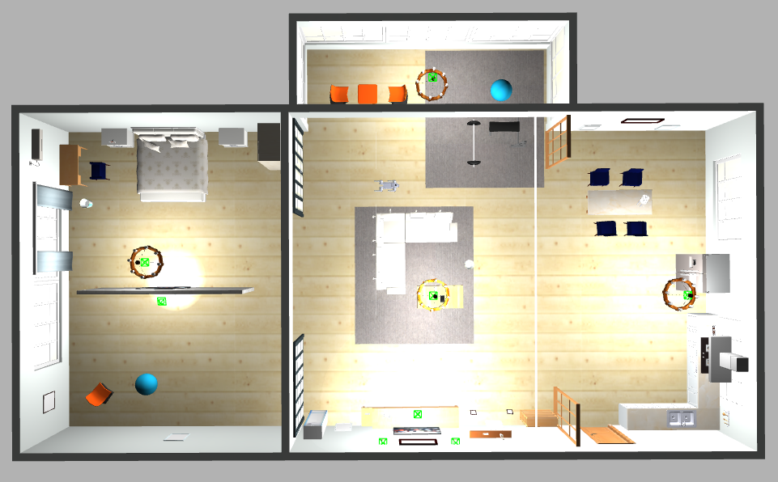
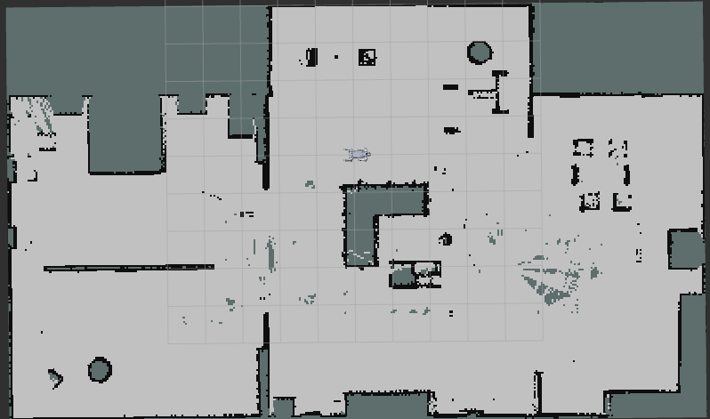
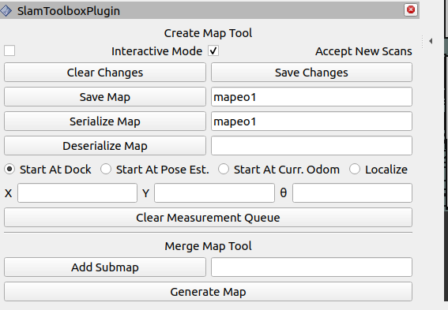
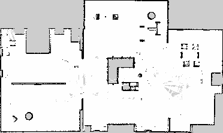

# Robot unitree go2 y SLAM

## Repositorio del robot go2 usado
En este apartado se explica los pasos realizados para que, a partir del repositorio de anujjain-dev, se pueda integrar correctamente la función de mapeo de SLAM toolbox. La versión de Ros usada en este repositorio es HUMBLE.
A continuación se comparte el link del repositorio de [anujjain](https://github.com/anujjain-dev/unitree-go2-ros2). El archivo README del repositorio original está incluido dentro de la carpeta `unitree-go2-ros2`.
Recuerde también de descargar SLAM toolbox.

## 1 Cambios a realizar para emplear SLAM

### 1.1 Cambiar el sensor
En el punto 2.6 del archivo README del repositorio original se explica como cambiar el sensor LIDAR 3D por uno tipo laser. Este cambio debe hacerse para tener mensajes tipo `/scan` necesarios para el mapeo.

### 1.2 Cambios en el archivo slam.launch.py
En el archivo `slam.launch.py` que se encuentra en la ruta `src/unitree-go2-ros2/robots/configs/go2_config/launch/slam.launch.py` se tiene, originalmente, la siguiente línea de código:

```bash
slam_launch_path = PathJoinSubstitution(
        [FindPackageShare('champ_navigation'), 'launch', 'slam.launch.py']
    )
```
Esto debe ser cambiado por lo siguiente:

```bash
slam_launch_path = PathJoinSubstitution(
        [FindPackageShare('slam_toolbox'), 'launch', 'online_async_launch.py']
    )
```
Con este cambio la función de mapeo se encuentra habilitada. Para probarlo se lanza la simulación en gazebo y el rviz con:

```bash
ros2 launch go2_config gazebo_velodyne.launch.py rviz:=true
```
En rviz agregue el plugin de Map y agregue como tópico `/map`. Si desea observar en rviz el funcionamiento del laser puede cambiar el tópico de LaserScan por `/scan` 
En otra terminal lance SLAM:

```bash
ros2 launch go2_config slam.launch.py sim:=true
```

Finalmente, en una terminal aparte active la herramienta de teleop para controlar el robot y observar la creación del mapa.

```bash
ros2 run teleop_twist_keyboard teleop_twist_keyboard
```

Es muy probable que el mapa que se crea no es preciso, por lo que se debe de realizar el siguiente cambio.

### 1.3 Cambios en el archivo gait.yaml
En el archivo `gait.yaml` que se encuentra en la ruta `src/unitree-go2-ros2/robots/configs/go2_config/config/gait/gait.yaml` cambiar el parámetro `odom_saler: 0.9` a  `odom_saler: 2.2`. Este valor puede ser modificado dependiendo del funcionamiento de su simulación en gazebo, con valores superiores a 2 y menores a 2.6 se tiene un buen resultado al momento de realizar el mapeo.
Luego de realizar estos cambios ya debería ser posible observar la creación del mapa de la escena, pero si no, el siguiente cambio puede ayudar.

### 1.4 Cambios en el archivo slam.yaml (opcional)
Los siguientes cambios ayudan a que el mapa se genere o actualice a una mayor velocidad. En el archivo `slam.yaml` en la ruta `src/unitree-go2-ros2/robots/configs/go2_config/launch/slam.launch.py` se cambia el parametro `map_update_interval: 5.0` a `map_update_interval: 1.0`, además, tambien se puede agregar al final del archivo:
```bash
min_pass_through: 1
occupancy_threshold: 0.1
```
Con estos cambios realizados se puede realizar un mapeo bastante preciso.


## 2 Agregar el mundo de small_house

Para probar estos cambios se empleó el archivo .world obtenido del repositorio de [mlherd/Dataset-of-Gazebo-Worls-Models-and-Maps](https://github.com/mlherd/Dataset-of-Gazebo-Worlds-Models-and-Maps/tree/master), más especificamente, se usó el archivo [small_house](https://github.com/mlherd/Dataset-of-Gazebo-Worlds-Models-and-Maps/tree/master/worlds/small_house).
Por la forma en como está configurado el repositorio del robot go2 se deben de realizar algunos cambios en los archivos que se obtiene luego de descargar el archivo `small_house.zip`.

### 2.1 Archivo small_house.world
En este archivo se debe de comentar o borrar las siguientes líneas de código:

```bash
    <include>
      <pose>-3.5 -4.5 0.0 0.0 0.0 1.58</pose>
      <uri>model://turtlebot3_waffle_pi</uri>
    </include>
```

Este cambio se hace debido a que, en el momento de lanzar la simulación de gazebo, incluye al robot `turtlebot3` y eso ocasiona un error.

### 2.2 Archivos model.sdf
Los archivos dentro de la carpeta `models` se encargan de armar el escenario en donde se realizará la simulación de gazebo. Dentro de este directorio hay más carpetas que contienen cada una de las partes del escenario, por ejemplo `aws_robomaker_residential_AirconditionerA_01`, dentro, por lo general, hay 4 archivos. El archivo `model.sdf` hay 2 líneas de código parecidas a esta:

```bash
<uri>file://models/aws_robomaker_residential_AirconditionerA_01/meshes/aws_AirconditionerA_01_collision.DAE</uri>
```

Estas líneas deben de ser cambiagas por lo siguiente:
```bash
<uri>model://aws_robomaker_residential_AirconditionerA_01/meshes/aws_AirconditionerA_01_collision.DAE</uri>
```

Este cambio se debe de hacer en todos los archivos `model.sdf` de todas las carpetas. En este repositorio se incluye una carpeta en donde este cambio fue aplicado a todos los modelos.

### 2.3 Agregar los archivos a gazebo y el launch
Luego de hacer los cambios en el archivo `small_house.world` se debe de agregar el mundo en el archivo launch del repositorio, esto se lo hace en `src/unitree-go2-ros2/robots/configs/go2_config/launch/gazebo_velodyne.launch.py` (archivo usado para lanzar el robot y el sensor, si se desea tambien se puede hacer lo mismo en el archivo `gazebo.launch.py`en la misma ruta). Se debe de cambiar la siguiente línea de código:

```bash
default_world_path = os.path.join(config_pkg_share, "worlds/default.world")
```

por:

```bash
default_world_path = os.path.join(config_pkg_share, "worlds/small_house.world")
```

En sí, cualquier escenario que se desee usar en gazebo debe de ser agregado en esta línea de código. Además, se debe incluir el archivo `small_house.world` dentro del directorio con ruta `src/unitree-go2-ros2/robots/configs/go2_config/worlds`.
Luego, se debe de añadir las carpetas de los modelos dentro de gazebo. Cada una de las carpetad models, por ejemplo `aws_robomaker_residential_AirconditionerA_01`, debe ser agregado en la carpta models dentro de gazebo, la ruta de esa carpeta, en mi caso, es  `~/.gazebo/models`, con ello, también se debe de incluir en esta ruta la carpeta `photos` obtenidas a partir del zip del repositorio de small_house.
Con estos cambios ya es posible realizar la simulación del robot en este escenario.

### 2.4 Prueba de mapeo
Luego de hacer todos estos cambios anteriormente mencionados, el resultado del mapping en el mundo `small_house` fue el siguiente:

#### Vista superior del escenario small_house
<div style="display: flex; gap: 50px;">
   
</div>

#### Vista superior en rviz del mapping de small_house
<div style="display: flex; gap: 50px;">
   
</div>

### Guardar archivos con la información del mapa
Para poder guardar el mapa se puede se puede utilizar el panel de rviz.

**1:** En rviz, en la parte superior izquierda, dar clic en la opción ```Panels``` y luego seleccionar la opción ```Add New Panel```.

**2:** En la ventana que aparece, dar clic en ```SlamToolboxPlugin```.

**3:** Aparecerá una ventana en la parte izquierda inferior, en ella se puede escribir el nombre con el que se desea guardar los archivos con información del mapping. La opción ```Save map``` generará un archivo ```.pgm```. La opción ```Serialize Map``` generará una archivo ```.data```.

<div style="display: flex; gap: 50px;">
   
</div>

#### Archivo .pgm generado
<div style="display: flex; gap: 50px;">
   
</div>


## 3 Navegación (aún en progreso)
Para realizar la navegación se necesita del mapa del mundo. Para ello se tienen 2 opciones:
* **1:** Usar Slam, mapear, volvar al lugar de inicio y lanzar el comando de navegación.
* **2:** Cambiar el archivo ```slam.yaml``` para que, una vez se use el comando de mapeo, aparezca el mapa guardado 

### 3.1 Cambios en Slam para visualizar (o continuar) un mapa guardado
En el archivo ```slam.yaml``` ubicado en la ruta ```src/unitree-go2-ros2/robots/configs/go2_config/config/autonomy/slam.yaml```se tiene originalmente:

```bash
    # ROS Parameters
    odom_frame: odom
    map_frame: map
    base_frame: base_footprint
    scan_topic: /scan
    mode: mapping #localization

    # if you'd like to immediately start continuing a map at a given pose
    # or at the dock, but they are mutually exclusive, if pose is given
    # will use pose
    #map_file_name: test_steve
    # map_start_pose: [0.0, 0.0, 0.0]
    #map_start_at_dock: true

```

Se debe de cambiar ```mode: mapping``` por ```mode: localization```. Descomentar ```map_file_name: ``` y escribir la ruta completa en la que se encuentra el archivo ```.data```, además, también se debe de descomentar ```map_stat_at_dock: true```. Por lo que código resultante será algo parecido a lo siguiente:

```bash
    # ROS Parameters
    odom_frame: odom
    map_frame: map
    base_frame: base_footprint
    scan_topic: /scan
    mode: localization

    # if you'd like to immediately start continuing a map at a given pose
    # or at the dock, but they are mutually exclusive, if pose is given
    # will use pose
    map_file_name: /home/nahin/g2_ws/mapeo1 #escribir la ruta completa en donde se encuentra el archivo .data (no se escribe la extensión, solo el nombre)
    # map_start_pose: [0.0, 0.0, 0.0]
    map_start_at_dock: true

```

### 3.2 Lanzar la navegación
Para poder lanzar la navegación se utiliza el comando ```ros2 launch go2_config navigate.launch.py``` (previamente se debió lanzar la simulación del robot y tener un mapa en el cual trabajar, de preferencia uno elavorado y guardado con anterioridad). Con la navegación activa, en rviz, se usa la herramienta de ```2D Global Pose``` para dibujar un vector. Al sostener el clic con el mouse en un lugar del mapa aparece un vector, al mover el mouse (aún con el clic sostenido) se cambia la dirección de este vector y con ello, al soltar el clic, se da la orden de pose y dirección al robot, el cual irá a la posición y orientación indicada con el vector previamente creado.


## Aspectos a tener en cuenta
Estos son algunos de los inconvenientes que se presentan al momento de probar la simulación:
* En algunas ocasiones, al momento de lanzar la simulación, gazebo se cierra inesperadamente, por lo que se debe de terminar el proceso y volver a lanzarlo.
* En ocasiones, al momento de lanzar gazebo, se presenta el robot "acostado" en el suelo, la forma de corregir esto es cerrando el proceso y volver a lanzar la simulación. Si el error persiste, la forma de corregirlo (al menos la que yo probé) es reiniciar la computadora.
* La simulación en gazebo puede ser algo pesada, si se presentan problemas de rendimiento, se pude desactivar las sombras en el apartado de `Scene` en la opción `shadows`.
* Cuando se inicia la simulación es posible ver al robot deslizarse por el suelo sin motivo aparante, es probable que en algún momento se haya cambiado un parametro que haga que surja este problema, la forma de solucionarlo (por lo que he probado) es cambiar, dentro de la opción de `Physics`, los parametros `real time update rate` y `max step size` a 200 y 0,005, respectivamente. Con ello el robot dejará de deslizarse, sin embargo, esto ocasiona problemas con algunas de las estructuras del escenario, tal como movimientos repetidos o la desaparación de estos objetos de la escena (no encontré solución a ese problema pero no altera el funcionamiento de la simulación).
* Aún se sigue trabajando en la navegación, es posible que al iniciarla se vea como el robot da "saltos" en su posición. Así mismo, al momento en que el robot llegue a la posición indicada, puede que este le tome tiempo en llegar a la orientación objetivo y que tenga una pequeña discrepancia entre la orientación final en la que quedó el robot y la que fue programada.

